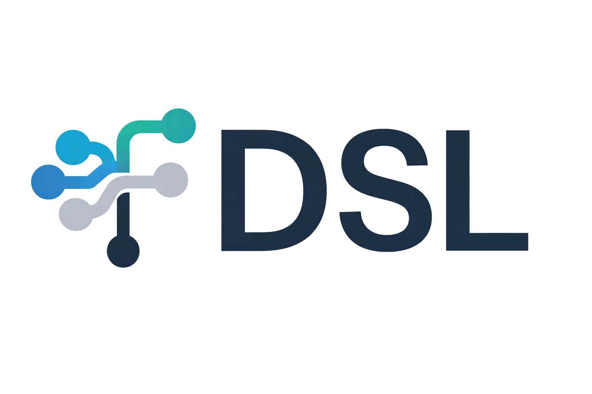

A declarative domain-specific language for building REST and WebSocket APIs. Generate production-ready FastAPI backends from high-level specifications.

---


## What is fDSL?

Define your data sources, entities, and UI components in a simple syntax. fDSL generates routers, services, authentication, WebSocket handlers, and frontend components.

```fDSL
Source<REST> ProductsAPI
  url: "http://api.example.com/products"
  operations: [read, create, update]
end

Entity Products
  source: ProductsAPI
  attributes:
    - id: integer @readonly;
    - name: string;
    - price: number;
    - stock: integer;
  access: public
end
```

**Generates:** FastAPI router, Pydantic models, service layer, and OpenAPI documentation.

---

## Features

- **Multi-Source Composition** - Aggregate multiple REST/WebSocket sources with computed fields
- **Rich Expressions** - Lambda functions and built-in functions for data transformation
- **WebSocket Support** - Real-time data streams with automatic synchronization
- **Flexible Auth** - HTTP Bearer, Basic, and API Key authentication with RBAC

---

## Installation

**Requirements:** Python >= 3.9, Git

```bash
git clone https://github.com/fkatsaras/functionality-dsl.git
cd functionality-dsl
python -m venv venv
source venv/bin/activate  # Windows: venv\Scripts\activate
pip install -e .
```

---

## Running Generated Apps

### With Docker (recommended)

```bash
cd generated
docker compose -p myapp up
```

### Without Docker

Requires **Node.js >= 20** for the frontend.

**Terminal 1 — backend:**
```bash
cd generated
python -m venv venv
source venv/bin/activate  # Windows: venv\Scripts\activate
pip install -e .
uvicorn app.main:create_app --factory --host 0.0.0.0 --port 8080 --reload
```

**Terminal 2 — frontend:**
```bash
cd generated/frontend
npm install
npm run dev
```

- Backend API + docs: `http://localhost:8080/docs`
- Frontend UI: `http://localhost:5173`

The frontend dev server automatically proxies `/api`, `/auth`, and `/ws` to the backend — no extra configuration needed.

> **Note:** If your spec uses `Auth` (roles/database), the generated app requires a running PostgreSQL instance configured via `DATABASE_URL` in the `.env` file. Specs with no auth and only external REST sources have no database dependency.

---

## CLI Commands

```bash
fdsl validate <file>                      # Validate syntax
fdsl generate <file> --out <dir>          # Generate FastAPI backend
fdsl visualize <file> --output <dir>      # Generate diagrams (Linux/WSL: requires graphviz, plantuml, imagemagick)
fdsl transform <spec> --out <file>        # OpenAPI/AsyncAPI to fDSL
```

---

## Documentation

- [Model & Metamodel Diagrams](docs/) - Generated visualizations for all examples

